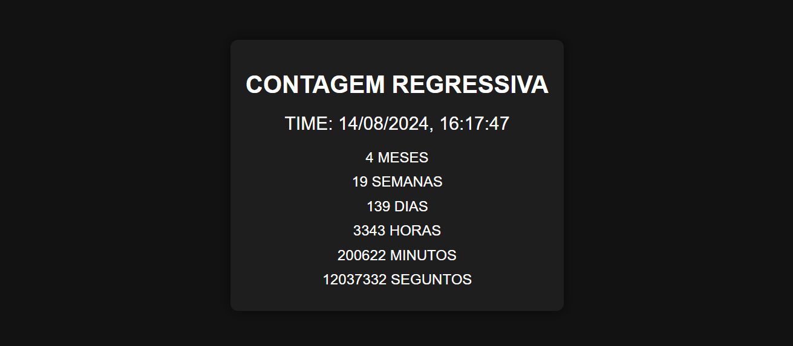

# ANO NOVO
👨‍🏫APP DE CONTAGEM REGRESSIVA PARA O ANO NOVO.

  

## DESCRIÇÃO:
Este aplicativo web é uma **contagem regressiva interativa e dinâmica para o Ano Novo**. Ele exibe a data e hora atuais e calcula automaticamente quanto tempo falta para o próximo Ano Novo, mostrando o total de meses, semanas, dias, horas, minutos e segundos restantes.

## FUNCIONALIDADES:
1. **Data e Hora Atuais**: Exibe a data e hora do sistema em tempo real.
2. **Contagem Regressiva**: Calcula e exibe quanto tempo falta para o próximo Ano Novo em:
   - Meses
   - Semanas
   - Dias
   - Horas (total até o Ano Novo)
   - Minutos (total até o Ano Novo)
   - Segundos (total até o Ano Novo)
3. **Consideração de Anos Bissextos**: O aplicativo considera se o ano atual é bissexto para calcular corretamente os dias restantes.

## COMO USAR?
1. **Acesse o site**:
   - Abra o arquivo `index.html` em um navegador da web. Não há necessidade de conexão com a internet, pois o aplicativo funciona localmente.

2. **Veja as informações**:
   - Ao abrir o site, você verá a data e hora atuais na parte superior.
   - Abaixo da data e hora, você verá a contagem regressiva para o Ano Novo, com o total de meses, semanas, dias, horas, minutos e segundos que faltam.

3. **Acompanhamento em Tempo Real**:
   - A contagem regressiva é atualizada a cada segundo, refletindo o tempo restante até o Ano Novo em tempo real.

## NÃO SABE?
- Entendemos que para manipular arquivos em `HTML`, `CSS` e outras linguagens relacionadas, é necessário possuir conhecimento nessas áreas. Para auxiliar nesse aprendizado, oferecemos cursos gratuitos disponíveis:
* [CURSO DE HTML E CSS](https://github.com/VILHALVA/CURSO-DE-HTML-E-CSS)
* [CURSO DE JAVASCRIPT](https://github.com/VILHALVA/CURSO-DE-JAVASCRIPT)
* [CONFIRA MAIS CURSOS](https://github.com/VILHALVA?tab=repositories&q=+topic:CURSO)

## CREDITOS:
- [PROJETO CRIADO PELO VILHALVA](https://github.com/VILHALVA)

